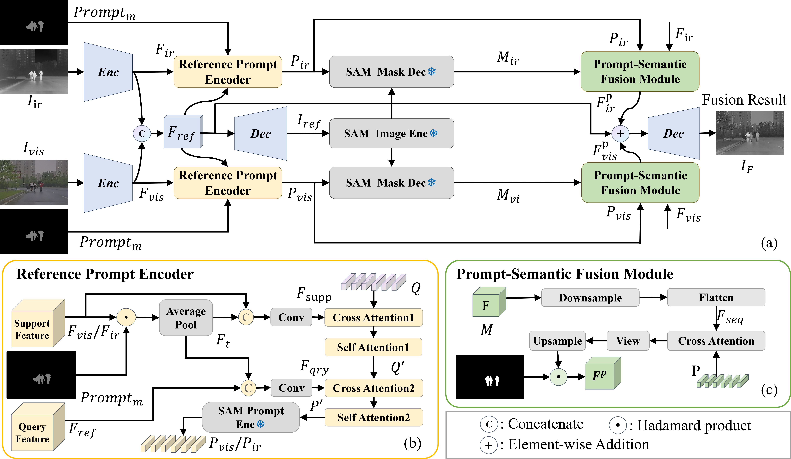

# [CtrlFuse: Mask-Prompt Guided Controllable Infrared and Visible Image Fusion] (Official PyTorch Implementation)

[]()
[](https://pytorch.org/)
[](https://github.com/[GithubUsername]/[RepoName])

This repository contains the official PyTorch implementation of the paper:
**"[CtrlFuse: Mask-Prompt Guided Controllable Infrared and Visible Image Fusion]"** (Accepted by [AAAI 2026])

> **Authors**: [Yiming Sun], [Yuan Ruan], [Qinghua Hu],[Pengfei Zhu]
> **Affiliation**: [VisDrone Group]

## 📢 News
- **[2026-01]**: Code and pre-trained models are released!
- **[2025-11-08]**: The paper is accepted by [AAAI 2026].

## 📜 Abstract
[Infrared and visible image fusion generates all-weather perception-capable images by combining complementary modalities, enhancing environmental awareness for intelligent unmanned systems. Existing methods either focus on pixel-level fusion while overlooking downstream task adaptability or implicitly learn rigid semantics through cascaded detection/segmentation models, unable to interactively address diverse semantic target perception needs. We propose CtrlFuse, a controllable image fusion framework that enables interactive dynamic fusion guided by mask prompts. The model integrates a multi-modal feature extractor, a reference prompt encoder (RPE), and a prompt-semantic fusion module(PSFM). The RPE dynamically encodes task-specific semantic prompts by fine-tuning pre-trained segmentation models with input mask guidance, while the PSFM explicitly injects these semantics into fusion features. Through synergistic optimization of parallel segmentation and fusion branches, our method achieves mutual enhancement between task performance and fusion quality. Experiments demonstrate state-ofthe-art results in both fusion controllability and segmentation accuracy, with the adapted task branch even outperforming the original segmentation model.]


*Figure 1: The overall architecture of our proposed [CtrlFuse].*

## 🔨 Requirements
The code has been tested with Python 3.8 and PyTorch 2.0.0 .

```bash
# 1. Create a conda environment
conda create -n ctrlfuse python=3.8
conda activate ctrlfuse

# 2. Install dependencies
pip install -r requirements.txt
```

## 📂 Data Preparation
Please organize your dataset as follows. Note: Ensure that the Visible and Infrared images are strictly aligned (registered) and have the same filenames.

```
Project_Root/
├── dataset/
│   ├── train/
│   │   ├── vi/             # Visible images (Grayscale or RGB)
│   │   │   ├── 1.jpg
│   │   │   └── ...
│   │   └── ir/           # Infrared images (Grayscale)
│   │   │   ├── 1.jpg
│   │   │   └── ...
│   │   └── mask/             # mask (Grayscale)
│   │       ├── 1.jpg
│   │       └── ...
│   └── test/
│   │   ├── vi/             # Visible images (Grayscale or RGB)
│   │   │   ├── 1.jpg
│   │   │   └── ...
│   │   └── ir/           # Infrared images (Grayscale)
│   │   │   ├── 1.jpg
│   │   │   └── ...
│   │   └── mask/             # mask (Grayscale)
│   │       ├── 1.jpg
│   │       └── ...
```

## 🚀 Usage

## 📊 Results

## 🤝 Citation

## 📧 Contact


